# Global Standard SisisFour

**Status:** Canonical / Global SSOT  
**Tanggal Acuan:** 17 September 2026  
**Kedudukan:** companion wajib `00_POLA_PENGERJAAN___SisisFour.md`; dibaca sebelum dokumen domain/fitur.

> Dokumen ini menetapkan **cara berpikir dan mapping global** untuk semua fitur SisisFour. Ia tidak menggantikan business rule domain. Dokumen domain menjelaskan *apa* aturannya; dokumen ini memastikan aturan tersebut diterapkan konsisten dari authorization sampai UI, persistence, export, audit, testing, dan deployment.

## 1. Prinsip Utama

Urutan keputusan fitur **tidak boleh dimulai dari UI, tombol, tabel, query, atau database**.

Canonical order:

```text
Menu / Fitur
→ Use Case
→ SSOT / Domain
→ Access Boundary
→ Capability
→ Scope
→ Period Context
→ Target Validation
→ Business Invariant
→ Persistence
→ Service Boundary
→ Presentation UI
→ Output Channel
→ Audit / Observability
→ Testing / Regression
→ Docs Sync
→ Deployment Gate
```

Perbedaan berikut wajib dijaga:

```text
Tidak lolos Access Boundary
!= punya akses tetapi capability tidak tersedia

Tidak punya capability
!= target berada di luar scope

Target berada dalam scope
!= otomatis lolos business invariant

UI menyembunyikan tombol
!= authorization

Role ada di sistem
!= otomatis punya akses semua domain
```

Global security stance:

```text
DEFAULT DENY
```

Role/context yang tidak dinyatakan berada di Access Boundary suatu domain **tidak mendapat akses** sampai SSOT memutuskan sebaliknya.

## 2. Master Mapping Global

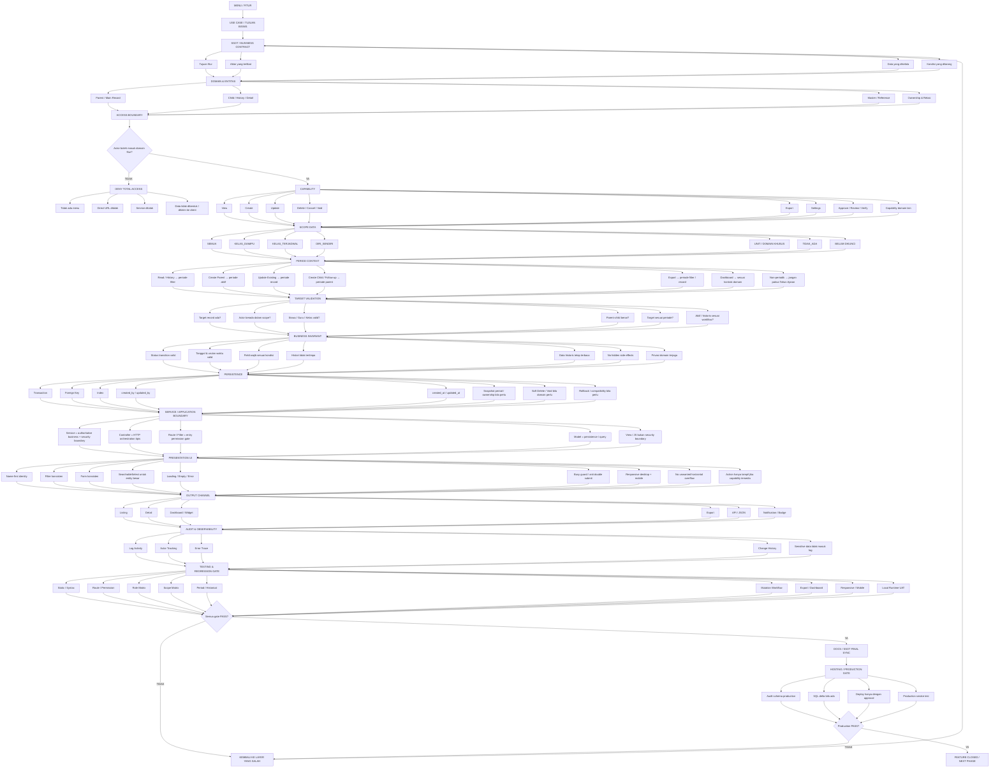

## 3. Authorization Standard

Access Boundary, Capability, Scope, Period, Target, dan Business Rule adalah layer berbeda dan tidak boleh dicampur.

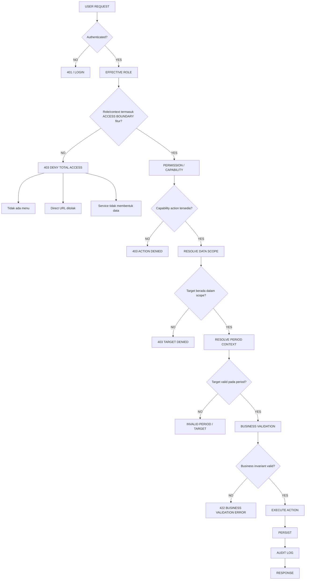

### Canonical wording

Jika actor tidak berada dalam Access Boundary, tulis:

```text
Siswa tidak memiliki akses ke fitur X.
```

Bukan:

```text
Siswa tidak boleh mengedit fitur X.
```

Capability matrix hanya memuat actor yang **sudah lolos Access Boundary**.

### Makna `Full Access`

```text
Full Access = seluruh capability operasional yang memang didefinisikan oleh domain.
```

`Full Access` **tidak otomatis** berarti:

```text
hard delete
cancel / void
settings
approval khusus
credential/security mutation
bypass scope
bypass business invariant
```

Capability dengan risiko tinggi harus ditetapkan eksplisit oleh kontrak domain.

### Makna `ReadOnly`

```text
ReadOnly = view/list/detail/search/filter pada scope yang sah.
```

ReadOnly tidak memberi mutation. `Export` juga **tidak otomatis** dianggap ReadOnly; export harus diputuskan sebagai capability tersendiri bila dibutuhkan.

## 4. Canonical Role Registry

Role resmi:

```text
admin
operator
pimpinan
bk
guru
siswa
kesehatan
ptsp
```

`Wali Kelas` adalah **context Guru**, bukan role tersendiri.

Effective role tetap mengikuti pola:

```text
primary role + secondary roles
→ permission
→ domain access boundary
→ capability
→ scope
```

Role baru tidak otomatis mewarisi domain role lain.

## 5. Domain Access Baseline — UKS / Kesehatan

Menu `UKS` mempunyai target fitur:

```text
Data CKG  -> Data Kesehatan Siswa
Data UKS  -> Catatan Harian UKS
```

Mapping yang sudah diputuskan:

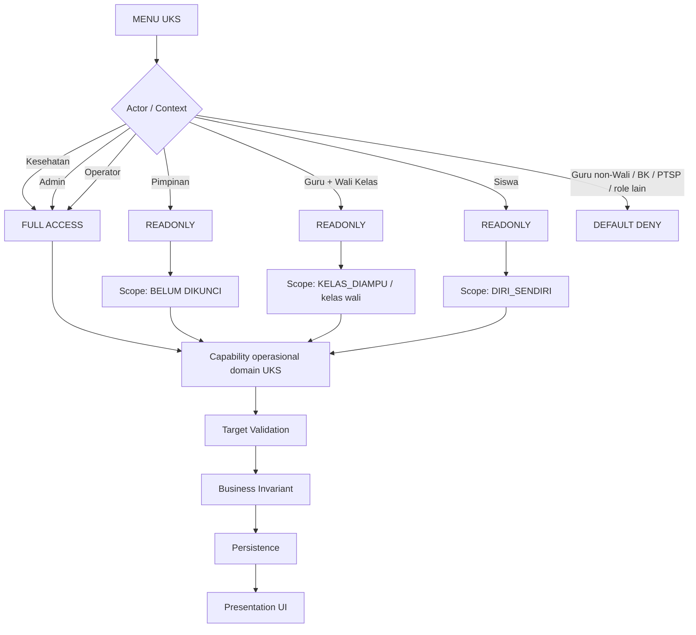

Canonical notes:

```text
Kesehatan/Admin/Operator = Full Access domain UKS.
Pimpinan                 = ReadOnly; scope belum dinyatakan eksplisit.
Guru + Wali              = ReadOnly hanya kelas wali/yang diampu sesuai kontrak domain.
Siswa                     = ReadOnly data dirinya sendiri.
Guru tanpa context Wali   = tidak otomatis punya akses.
BK/PTSP/role lain         = default deny sampai SSOT mengubahnya.
```

Sebelum implementasi UKS, domain document harus mengunci minimal:

```text
scope Pimpinan
period context Data CKG
period context Catatan Harian UKS
capability export
capability destructive/correction
privacy/medical-data exposure
actor identity untuk Role Kesehatan
```

## 6. Domain Access Baseline — PTSP

Menu `PTSP` mempunyai target fitur:

```text
Layanan PTSP      -> Form Pendaftaran Layanan PTSP
Polling Kepuasan  -> Form Polling Kepuasan Layanan Madrasah/PTSP
Pengaduan         -> Form Pengaduan intern maupun ekstern
```

Mapping yang sudah diputuskan:

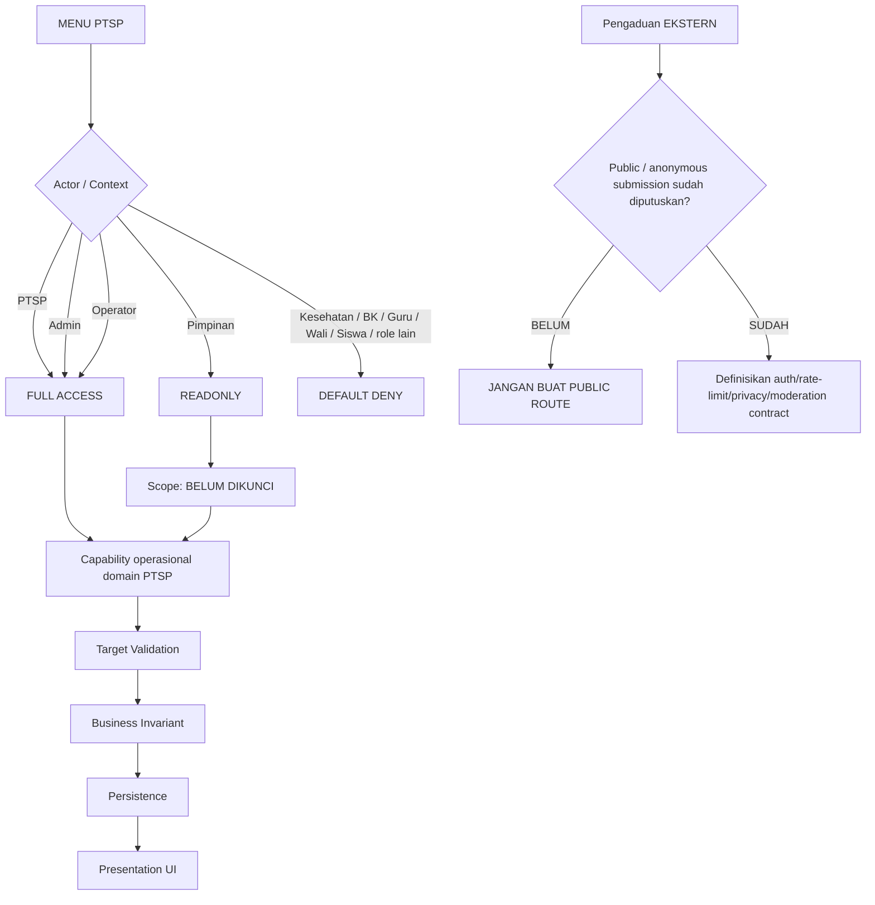

Canonical notes:

```text
PTSP/Admin/Operator = Full Access domain PTSP.
Pimpinan            = ReadOnly; scope belum dinyatakan eksplisit.
Role lain           = default deny sampai SSOT mengubahnya.
```

Istilah `Pengaduan ekstern` **belum sama dengan keputusan public/anonymous access**. Sebelum implementasi jalur eksternal, wajib diputuskan:

```text
siapa yang boleh submit
apakah login wajib
anonymous vs identified submitter
rate limit / anti-spam
lampiran bila ada
privacy data pelapor
status/tindak lanjut pengaduan
siapa yang boleh melihat identitas pelapor
retention/audit
```

Hal yang sama berlaku bila `Polling Kepuasan` kelak ingin dibuka untuk publik: public access harus menjadi keputusan eksplisit, bukan inferensi dari nama fitur.

## 7. Period Context Standard

Canonical untuk domain periodik/Tahun Ajaran:

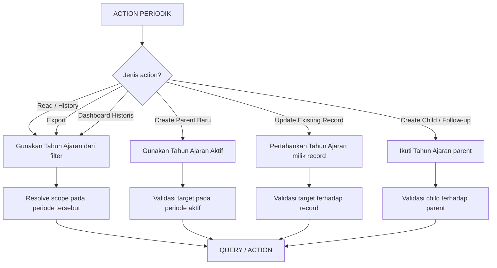

Artinya:

```text
Read/History            -> period filter
Create Parent           -> period aktif
Update Existing         -> period record
Create Child/Follow-up  -> period parent
Export                  -> period yang sedang dibaca
```

Filter histori **tidak otomatis** menjadi period tempat record parent baru dibuat.

Tidak semua domain harus periodik. PTSP, misalnya, tidak boleh diberi Tahun Ajaran hanya karena fitur lain memilikinya. Period context harus berasal dari domain contract.

## 8. Parent / Child / History Standard

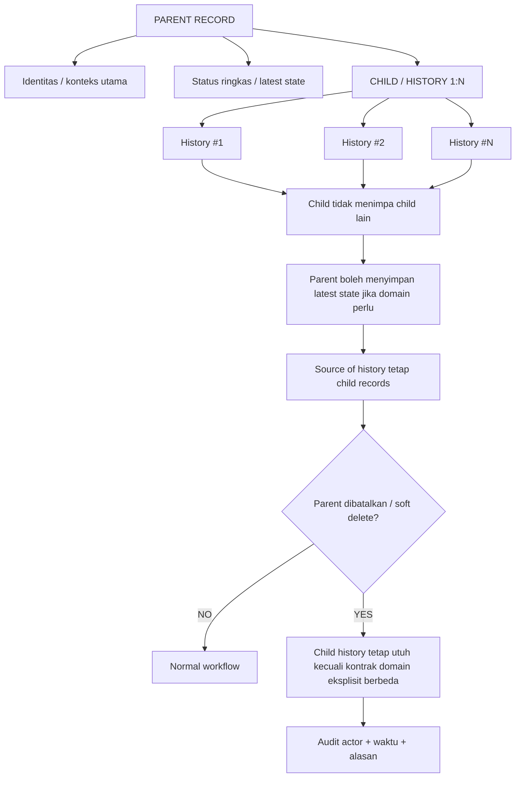

Hard delete, cascade delete, soft delete, cancel, dan void **bukan sinonim**. Pilih hanya setelah business contract eksplisit.

## 9. Application Responsibility Standard

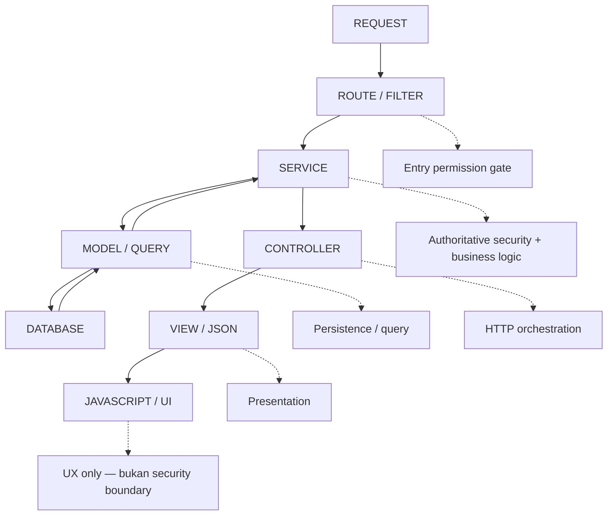

Responsibility:

```text
Route / Filter = pintu pertama
Service        = keputusan final authorization + business rule
Model          = persistence / query
Controller     = orchestration request / response
View / JS      = presentation / UX
```

Security/business validation tidak boleh hanya hidup di View atau JavaScript.

## 10. UI / UX Global Standard

```mermaid
flowchart TD
    A["DATA + CAPABILITY DARI SERVER"] --> B["RENDER UI"]

    B --> C["IDENTITY"]
    C --> C1["Nama = primary"]
    C --> C2["Identifier = secondary"]

    B --> D["FILTER"]
    D --> D1["Tahun Ajaran untuk tabel periodik"]
    D --> D2["Default = Tahun Ajaran aktif"]
    D --> D3["Reset = kembali default"]
    D --> D4["Filter padat desktop = 2+ baris bila perlu"]
    D --> D5["Jangan paksa field terlalu sempit"]

    B --> E["FORM"]
    E --> E1["Logical grouping"]
    E --> E2["Server validation tetap wajib"]
    E --> E3["SearchableSelect untuk entity besar"]
    E --> E4["Pertahankan input saat error bila aman"]

    B --> F["TABLE / LIST"]
    F --> F1["Desktop table bila sesuai"]
    F --> F2["Mobile card/list bila table tidak cocok"]
    F --> F3["No unwanted horizontal body overflow"]
    F --> F4["Pagination reusable"]

    B --> G["ACTION"]
    G --> G1["Tampil hanya jika capability tersedia"]
    G --> G2["Busy guard"]
    G --> G3["Destructive action = project confirmation"]
    G --> G4["Tidak memakai native confirm()"]

    B --> H["STATE"]
    H --> H1["Loading"]
    H --> H2["Empty"]
    H --> H3["Filtered Empty"]
    H --> H4["Error"]
    H --> H5["Forbidden / unavailable"]
    H --> H6["Session expired"]

    B --> I["RESPONSIVE"]
    I --> I1["Desktop nyaman"]
    I --> I2["Mobile portrait nyaman"]
    I --> I3["Touch target cukup"]
    I --> I4["Modal scroll vertikal"]
    I --> I5["Safe-area / WebView aware"]
```

## 11. Output Channel Consistency

Satu business rule harus konsisten pada seluruh output channel yang relevan.

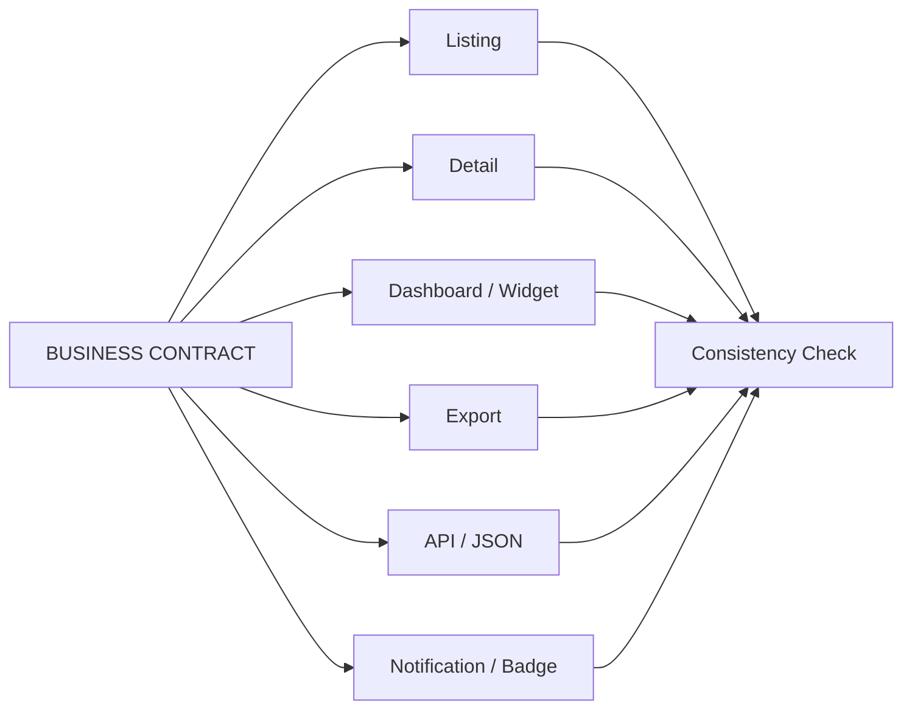

Data yang dilarang untuk sebuah role tidak boleh disembunyikan hanya di UI sementara masih dikirim melalui JSON/export/dashboard.

## 12. Cross-role Regression Standard

Setiap fitur diuji terhadap **seluruh role resmi**, lalu context Wali diuji sebagai cabang Guru bila domain terkait kelas.

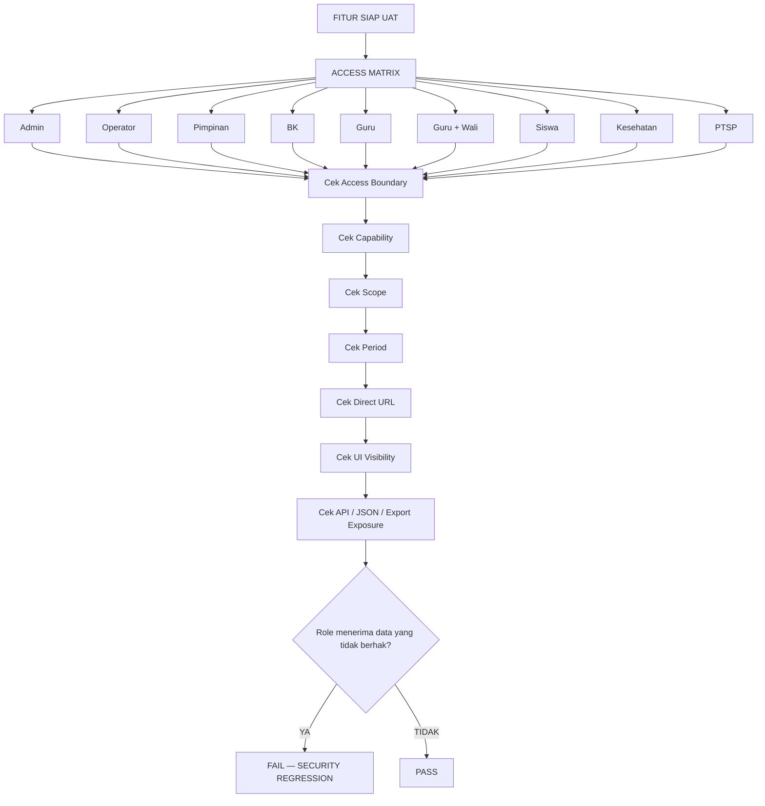

Wali Kelas adalah **context Guru**, bukan role baru. Role Kesehatan dan PTSP adalah role resmi dan harus selalu masuk regression matrix, termasuk saat expected result-nya `DENY`.

## 13. Feature Development Gate

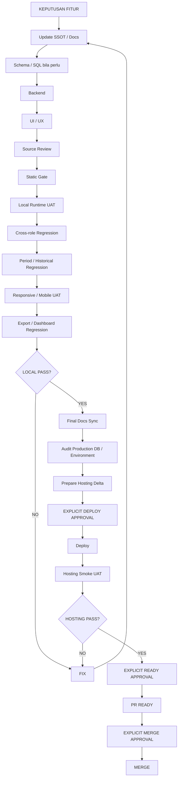

Tidak boleh:

```text
local PASS -> otomatis deploy
hosting PASS -> otomatis PR Ready
Ready -> otomatis merge
```

Setiap gate tetap memerlukan approval eksplisit sesuai `00_POLA_PENGERJAAN___SisisFour.md`.

## 14. Checklist Mapping Fitur Baru / Perubahan Fitur

Sebelum coding, jawaban berikut harus jelas:

```text
[ ] Nama fitur / domain
[ ] Tujuan bisnis
[ ] Parent / child / master / reference
[ ] Role/context yang masuk Access Boundary
[ ] Role/context yang default-deny
[ ] Capability matrix
[ ] Makna Full Access bila istilah itu dipakai
[ ] Makna ReadOnly bila istilah itu dipakai
[ ] Scope per capability
[ ] Scope Pimpinan bila diberi ReadOnly
[ ] Period Context / non-periodik
[ ] Target Validation
[ ] Business Invariant
[ ] Persistence / transaction / FK / audit actor
[ ] Service boundary
[ ] Route/permission
[ ] Presentation UI
[ ] Listing/detail/dashboard/export/API implications
[ ] Logging / observability
[ ] Public/external access bila ada
[ ] Privacy / sensitive-data policy bila ada
[ ] Local test matrix
[ ] Cross-role regression semua role resmi
[ ] Historical/period regression bila relevan
[ ] Mobile/responsive regression
[ ] Production/deployment impact
```

Jika satu item belum jelas dan berpengaruh pada data/security/business rule, **jangan menebak**. Kunci keputusan terlebih dahulu di SSOT.

## 15. Aturan Membaca Docs

Urutan kerja minimal setiap memulai/melanjutkan fitur:

```text
1. docs/00_POLA_PENGERJAAN___SisisFour.md
2. docs/00A_GLOBAL_STANDARD_SISFOUR.md
3. dokumen domain yang terkait
4. docs/03_AUTH_RBAC_MENU bila menyentuh akses/scope
5. docs/11/13/14 bila menyentuh UI/mobile
6. docs/15_TESTING_POLISH bila masuk gate
7. source + schema aktual
```

Jika ada konflik:

```text
Keputusan user terbaru yang eksplisit
→ sinkronkan ke SSOT
→ domain contract
→ Global Standard
→ implementation
```

Jangan membiarkan keputusan baru hanya berada di chat.

Role/domain baru wajib disinkronkan ke dokumen domain/RBAC sebelum implementasi source. `00/00A` menetapkan arah global; ia tidak menggantikan detail schema, permission key, menu row, route, ataupun workflow domain.

## 16. Quick Reference

Gunakan diagram ini untuk review cepat sebelum coding:

```mermaid
flowchart LR
    A["Menu / Fitur"]
    --> B["Use Case"]
    --> C["SSOT / Domain"]
    --> D["Access Boundary"]
    --> E["Capability"]
    --> F["Scope"]
    --> G["Period Context"]
    --> H["Target Validation"]
    --> I["Business Invariant"]
    --> J["Persistence"]
    --> K["Service Boundary"]
    --> L["Presentation UI"]
    --> M["Output Channel"]
    --> N["Audit"]
    --> O["Testing / Regression"]
    --> P["Docs Sync"]
    --> Q["Deployment Gate"]
```

Dokumen ini harus diperbarui hanya jika **pola global aplikasi, role registry, atau baseline Access Boundary lintas-domain** berubah. Business rule rinci tetap ditulis di dokumen domain masing-masing agar SSOT tidak duplikatif dan tidak mudah drift.
