# Global Standard SisisFour

**Status:** Canonical / Global SSOT  
**Tanggal Acuan:** 17 September 2026  
**Kedudukan:** companion wajib `00_POLA_PENGERJAAN___SisisFour.md`; dibaca sebelum dokumen domain/fitur.

> Dokumen ini menetapkan **cara berpikir dan mapping global** untuk semua fitur SisisFour. Ia tidak menggantikan business rule domain. Dokumen domain menjelaskan *apa* aturannya; dokumen ini memastikan aturan diterapkan konsisten dari authorization sampai UI, persistence, export, audit, API, testing, dan deployment.

## 1. Canonical Mapping

Urutan keputusan fitur:

```text
Menu / Fitur
→ Use Case
→ SSOT / Domain
→ Access Boundary
→ Capability
→ Scope
→ Period Context
→ Target Validation
→ Business Invariant
→ Persistence
→ Service Boundary
→ Presentation UI
→ Output Channel
→ Audit / Observability
→ Testing / Regression
→ Docs Sync
→ Deployment Gate
```

Perbedaan berikut wajib dijaga:

```text
Tidak lolos Access Boundary
!= punya akses tetapi capability tidak tersedia

Tidak punya capability
!= target berada di luar scope

Target berada dalam scope
!= otomatis lolos business invariant

UI menyembunyikan tombol
!= authorization

Role ada di sistem
!= otomatis punya akses semua domain

Full Access pada domain A
!= Full Access pada domain B
```

Global security stance:

```text
DEFAULT DENY
```

Role/context yang tidak dinyatakan berada di Access Boundary suatu domain tidak mendapat akses sampai SSOT memutuskan sebaliknya.

## 2. Master Mapping Global

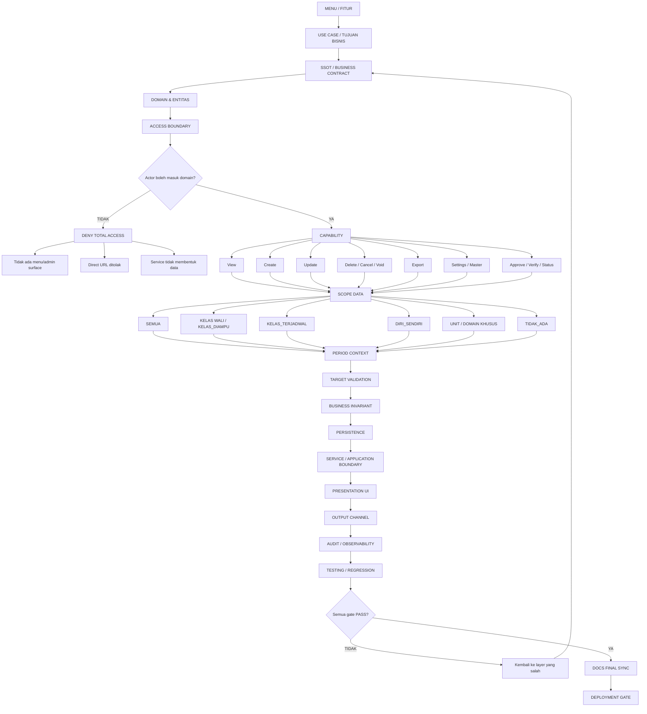

## 3. Authorization Standard

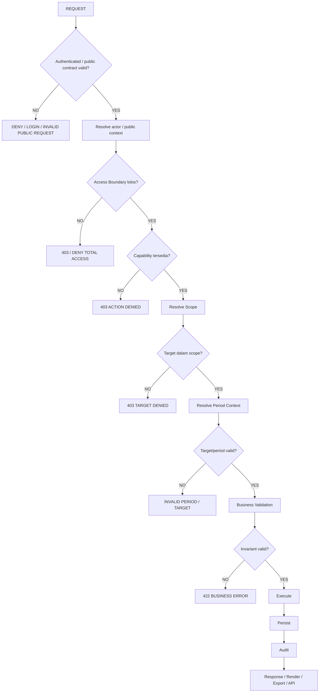

Canonical wording:

```text
Actor di luar Access Boundary:
"tidak memiliki akses fitur X"

Actor di dalam Access Boundary tetapi capability tidak ada:
"tidak memiliki capability action X"
```

Jangan mencampur dua kondisi tersebut.

## 4. Full Access / ReadOnly

```text
Full Access = seluruh capability operasional yang DIDEFINISIKAN domain.
```

Full Access tidak otomatis berarti:

```text
akses semua domain
hard delete
cancel / void
settings
approval khusus
bypass scope
bypass business invariant
```

`ReadOnly` berarti kemampuan baca pada scope yang sah. Export tidak otomatis ikut ReadOnly; export diputuskan eksplisit per domain.

## 5. Canonical Role Registry

```text
admin
operator
pimpinan
bk
guru
siswa
kesehatan
ptsp
```

`Wali Kelas` = context Guru, bukan role baru.

Identity:

```text
Guru       -> users.id_guru
Siswa      -> users.id_siswa
BK         -> users.id_pegawai
Kesehatan  -> users.id_pegawai
PTSP       -> users.id_pegawai
```

Multi-role = diperbolehkan.

```text
users.role UNION user_roles.role
→ permission
→ Access Boundary
→ Capability
→ Scope
→ Target/Period Validation
```

## 6. Domain Access Baseline — UKS

Detail SSOT: `17_UKS_KESEHATAN — SisisFour.md`.

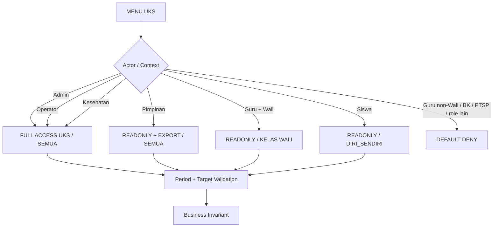

Canonical UKS baseline:

```text
Data CKG + Catatan Harian UKS = periodik Tahun Ajaran
Pimpinan = ReadOnly SEMUA + XLSX
Wali = hanya kelas wali, termasuk histori pada periode lama
Siswa = seluruh kesehatan dirinya sendiri, view only
Admin/Operator/Kesehatan = edit + import + export + soft delete + master sesuai domain
Guru non-Wali = tidak memiliki akses UKS
```

## 7. Domain Access Baseline — PTSP

Detail SSOT: `18_PTSP — SisisFour.md`.

Internal admin surface:

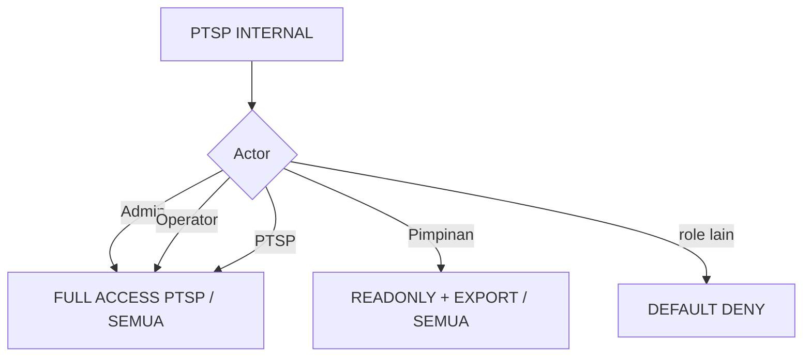

Public surface:

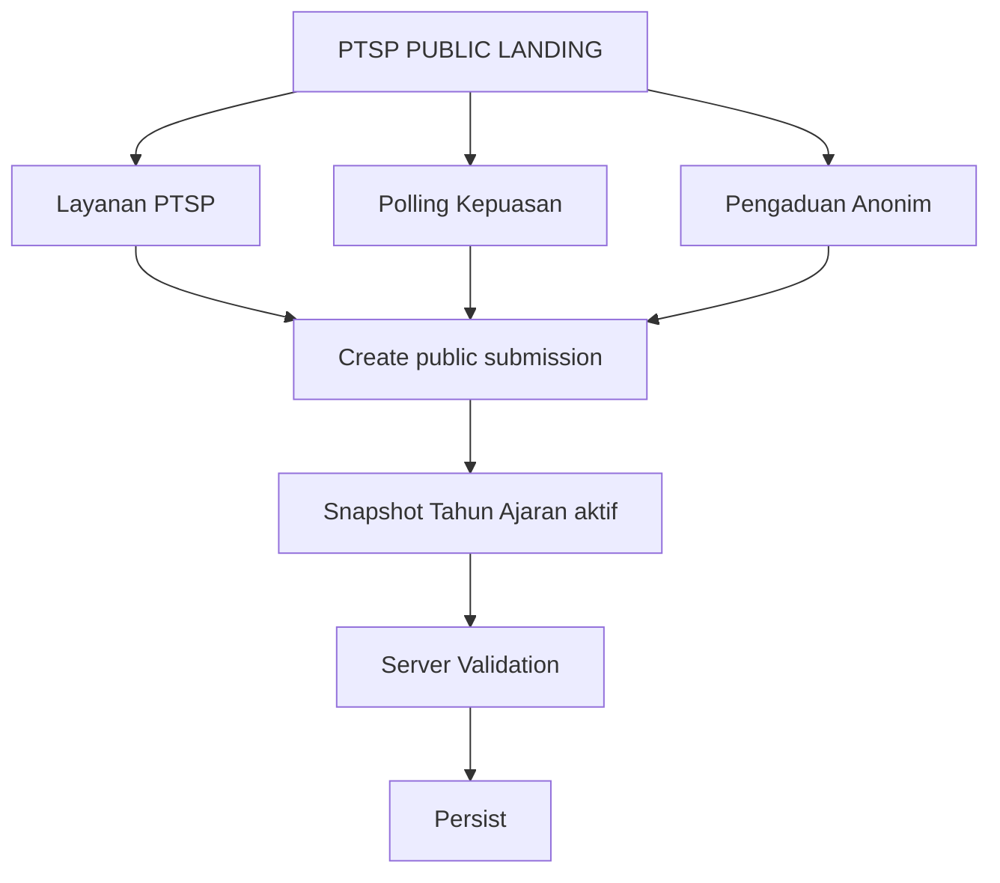

Canonical PTSP baseline:

```text
PTSP/Admin/Operator = Full Access hanya domain PTSP
Pimpinan = ReadOnly SEMUA + XLSX
Layanan/Polling/Pengaduan = public form tanpa login
Layanan status = Baru -> Diproses -> Selesai
Pengaduan status = Masuk -> Diverifikasi -> Diproses/Selesai
Pengaduan = satu form anonim, internal/eksternal tidak dibedakan
Hard delete PTSP = Admin/Operator/PTSP
Thermal print = bukti pengisian, tanpa nomor tiket/antrian/tracking
```

## 8. Public Statistics API Standard

Jika domain menyediakan API statistik untuk portal publik, gunakan pola:

```text
Public GET only
Aggregate only
No PII
No raw record
Period/filter explicit
CORS/public consumption sesuai contract
```

PTSP wajib menyediakan statistik public per form:

```text
Layanan
Polling
Pengaduan
```

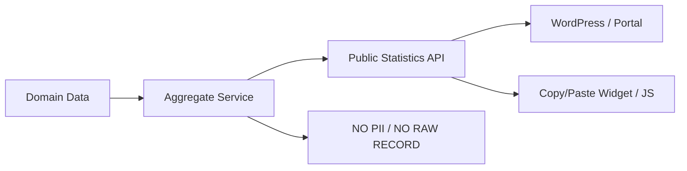

Public statistics API tidak boleh menjadi backdoor untuk melewati Access Boundary internal.

## 9. Period Context Standard

Canonical untuk domain periodik:

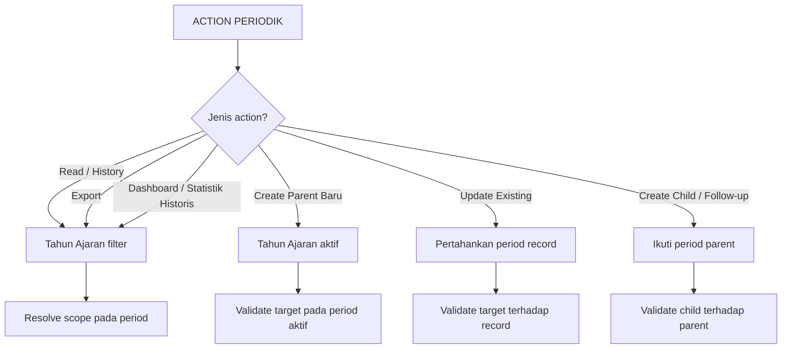

Tidak semua tabel harus periodik. Tahun Ajaran hanya dipakai jika domain contract menetapkannya.

## 10. Parent / Child / Delete Standard

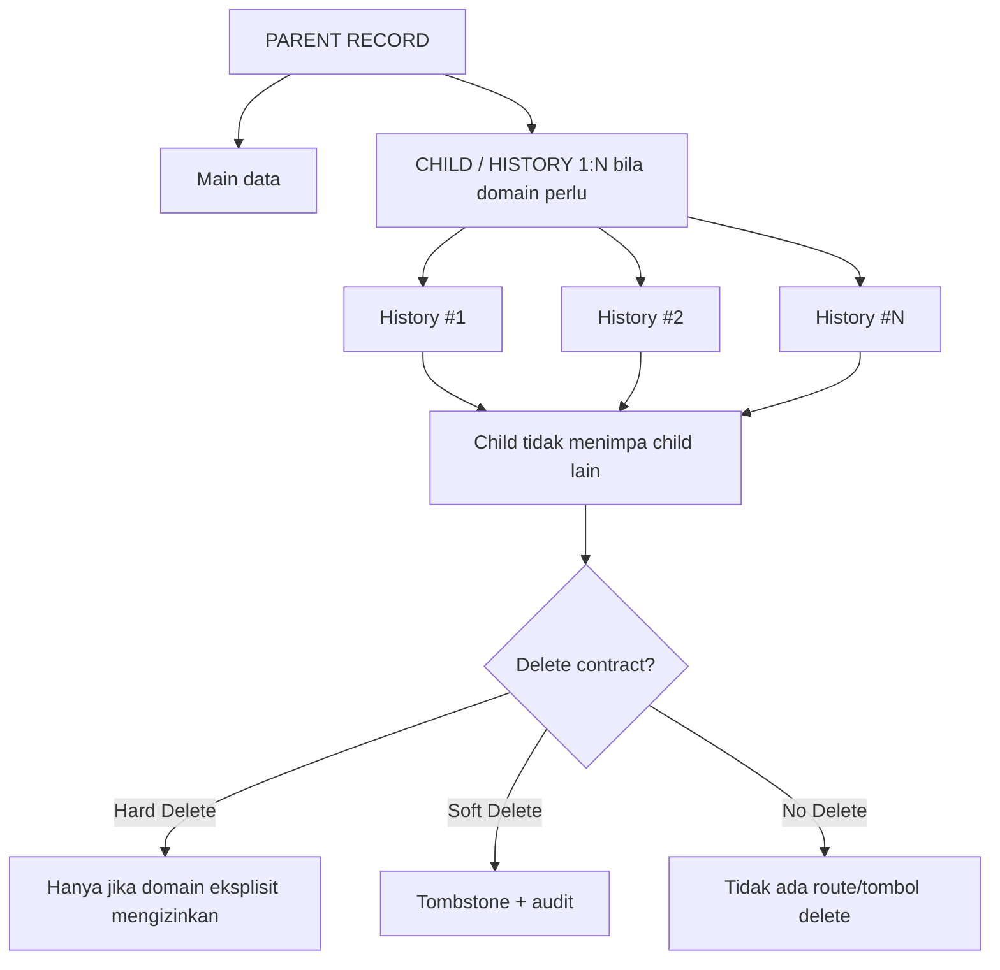

Hard delete, soft delete, cancel, void, dan no-delete adalah kontrak berbeda dan tidak boleh dianggap sinonim.

## 11. Application Responsibility

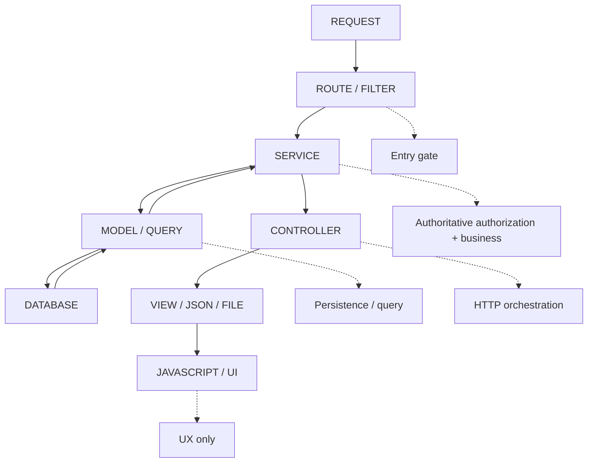

Security/business validation tidak boleh hanya hidup di View/JavaScript.

## 12. Presentation UI / Output Channel

Global UI:

```text
Name-first identity
SearchableSelect untuk entity besar
filter periodik default Tahun aktif
filter padat desktop boleh 2+ baris
loading / empty / filtered-empty / error
busy guard
project confirmation untuk destructive action
responsive desktop/mobile
no unwanted horizontal body overflow
safe-area / touch target
```

Satu business rule harus konsisten pada seluruh output:

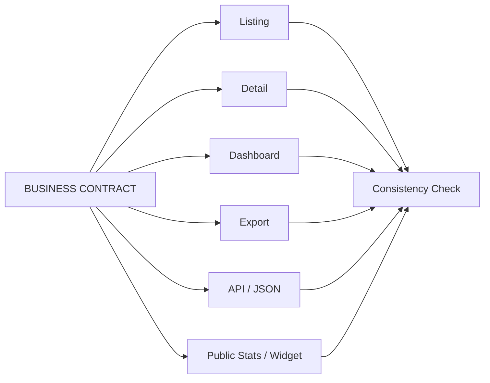

Data yang dilarang untuk actor tidak boleh disembunyikan hanya di UI sementara masih dikirim melalui JSON/export/API lain.

## 13. Cross-role Regression

Seluruh role resmi wajib masuk regression matrix, termasuk expected result `DENY`.

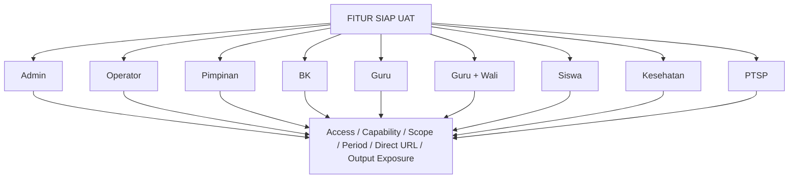

Public surface ditest terpisah dari authenticated role matrix.

## 14. Feature Development Gate

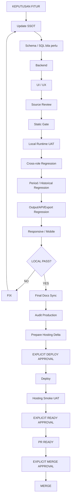

Tidak boleh:

```text
local PASS -> otomatis deploy
hosting PASS -> otomatis Ready
Ready -> otomatis merge
```

## 15. Checklist Fitur Baru

```text
[ ] Nama fitur / domain
[ ] Tujuan bisnis
[ ] Parent / child / master / reference
[ ] Access Boundary
[ ] Capability matrix
[ ] Scope per capability
[ ] Period Context
[ ] Target Validation
[ ] Business Invariant
[ ] Delete/cancel contract
[ ] Persistence / transaction / FK / actor audit
[ ] Service boundary
[ ] Route / permission
[ ] Public access bila ada
[ ] Export / API / statistics implications
[ ] Presentation UI
[ ] Logging / observability
[ ] Cross-role regression semua role resmi
[ ] Public-surface regression bila ada
[ ] Historical/period regression
[ ] Mobile/responsive regression
[ ] Production/deployment impact
```

Jika satu item belum jelas dan mempengaruhi data/security/business rule, jangan menebak. Kunci keputusan di SSOT atau tandai `OPEN`.

## 16. Aturan Membaca Docs

```text
1. docs/00_POLA_PENGERJAAN___SisisFour.md
2. docs/00A_GLOBAL_STANDARD_SISFOUR.md
3. dokumen domain terkait
4. docs/03_AUTH_RBAC_MENU bila menyentuh akses/scope
5. docs/11/13/14 bila menyentuh UI/mobile
6. docs/15_TESTING_POLISH bila masuk gate
7. source + schema aktual
```

Keputusan user terbaru yang eksplisit harus disinkronkan ke SSOT; jangan membiarkan keputusan penting hanya berada di chat.

## 17. Quick Reference

```mermaid
flowchart LR
    A["Menu/Fitur"]
    --> B["Use Case"]
    --> C["Domain"]
    --> D["Access Boundary"]
    --> E["Capability"]
    --> F["Scope"]
    --> G["Period"]
    --> H["Target Validation"]
    --> I["Business Invariant"]
    --> J["Persistence"]
    --> K["Service Boundary"]
    --> L["UI"]
    --> M["Output/API"]
    --> N["Audit"]
    --> O["Testing"]
    --> P["Docs Sync"]
    --> Q["Deployment Gate"]
```

Dokumen ini diperbarui jika pola global, role registry, public-surface standard, atau baseline Access Boundary lintas-domain berubah. Detail workflow tetap berada di dokumen domain agar SSOT tidak drift.