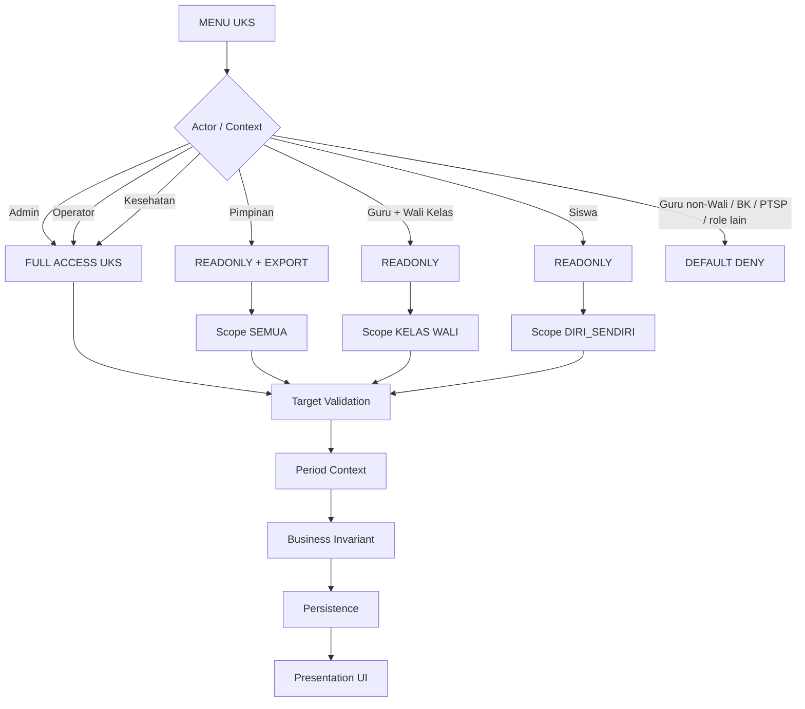

# UKS / Kesehatan — SisisFour

**Status:** Canonical / G3.6A Implementation Active
**Tanggal Acuan:** 18 September 2026
**Global guardrail:** `00_POLA_PENGERJAAN___SisisFour.md` + `00A_GLOBAL_STANDARD_SISFOUR.md`
**Source field:** workbook `field-form-UKS-CKG-PTSP.xlsx`, sheet `Form UKS` dan `Form CKG`.

> Dokumen ini adalah SSOT domain UKS/Kesehatan. Keputusan user terbaru mengalahkan catatan lama pada workbook bila ada konflik.

## 1. Role & Identity

Role resmi domain:

```text
kesehatan
```

Identity:

```text
Role Kesehatan -> Pegawai -> users.id_pegawai
multi-role      -> YA
```

Full Access Kesehatan **hanya berlaku pada domain UKS**, bukan seluruh aplikasi.

## 2. Menu

```text
UKS
├── Data CKG   -> Data Kesehatan Siswa
├── Data UKS   -> Catatan Harian UKS
└── Master UKS -> Keluhan / Tindakan / Hasil Kunjungan
```

## 3. Access Boundary / Capability / Scope



Canonical matrix:

| Actor | View | Create | Update | Import CKG | Export XLSX | Soft Delete | Kelola Master | Scope |
|---|---|---|---|---|---|---|---|---|
| Admin | YA | YA | YA | YA | YA | YA | YA | SEMUA |
| Operator | YA | YA | YA | YA | YA | YA | YA | SEMUA |
| Kesehatan | YA | YA | YA | YA | YA | YA | YA | SEMUA |
| Pimpinan | YA | TIDAK | TIDAK | TIDAK | YA | TIDAK | TIDAK | SEMUA |
| Guru + Wali | YA | TIDAK | TIDAK | TIDAK | TIDAK | TIDAK | TIDAK | KELAS WALI |
| Siswa | YA | TIDAK | TIDAK | TIDAK | TIDAK | TIDAK | TIDAK | DIRI_SENDIRI |

Guru tanpa context Wali **tidak memiliki akses UKS**.

## 4. Period Context

Data CKG dan Catatan Harian UKS adalah domain periodik Tahun Ajaran.

```text
Read / History     -> Tahun Ajaran filter
Create             -> Tahun Ajaran aktif server-side
Update Existing    -> tetap Tahun Ajaran record
Export             -> Tahun Ajaran terpilih + scope actor
Reset filter       -> Tahun Ajaran aktif
```

Wali historis:

```text
pilih Tahun Ajaran lama
-> scope Wali dihitung terhadap kelas wali pada periode tersebut
-> bukan kelas wali Tahun Ajaran aktif
```

Kelas pada histori harus merepresentasikan kelas siswa pada periode/kejadian record, bukan kelas aktif siswa saat ini.

## 5. Data CKG

Satu siswa boleh mempunyai lebih dari satu pemeriksaan CKG dalam satu Tahun Ajaran.

Field canonical dari workbook:

```text
Tanggal
Kelas
Nama Siswa
Berat badan (kg)
Tinggi badan (cm)
Status gizi (BB/U)
  - Normal
  - Kurus
  - Sangat kurus
  - Gemuk
  - Obesitas
Status tinggi (TB/U)
  - Normal
  - Pendek
  - Sangat pendek
Lingkar perut (cm)
Tekanan darah sistol
Tekanan darah diastol
Gula darah (mg/dL)
Kondisi gigi dan mulut
  - Normal
  - Karies
  - Gusi bermasalah
  - Kebersihan kurang
Visus mata kanan
Visus mata kiri
Buta warna
  - Ya
  - Tidak
Hasil tes pendengaran
  - Normal
  - Terganggu
  - Serumen
Skrining talasemia (kelas VII)
  - Tidak dilakukan
  - Negatif
  - Perlu pemeriksaan lanjut
Skrining tuberkulosis
  - Negatif
  - Terduga, perlu rujukan
```

### Import Excel

CKG mendukung import Excel.

Canonical rule:

```text
Import -> resolve siswa -> validasi membership Tahun Ajaran -> validate field -> insert/update
```

Duplicate rule:

```text
siswa + tanggal pemeriksaan sudah ada
-> UPDATE record existing
-> bukan insert duplikat baru
```

Stable key import **LOCKED**:

```text
NISN = WAJIB dan menjadi key identitas siswa pada file import
Nama = display/verifikasi saja
Nama TIDAK boleh menjadi fallback key
```

Duplicate import **LOCKED**:

```text
record aktif siswa + tanggal sudah ada -> UPDATE
record lama sudah soft-deleted          -> INSERT record aktif baru
soft-deleted record                     -> TIDAK auto-restore
```

## 6. Catatan Harian UKS

Satu kunjungan siswa = satu parent record. Tidak ada kebutuhan child/follow-up 1:N pada kontrak saat ini.

Field canonical dari workbook:

```text
Tanggal
Jam masuk
Kelas
Nama siswa
Keluhan
  - Demam
  - Sakit kepala
  - Sakit perut
  - Mual atau muntah
  - Diare
  - Batuk pilek
  - Sakit gigi
  - Nyeri haid
  - Lemas atau pingsan
  - Mimisan
  - Luka atau lecet
  - Keseleo
  - Sesak napas
  - Gatal atau alergi
  - Sakit mata
  - Cedera olahraga
  - Lainnya
Catatan keluhan (opsional)
Suhu tubuh °C (opsional)
Tekanan darah (opsional)
Tindakan, multi-pilih
  - Istirahat
  - Kompres
  - Minum air hangat atau oralit
  - Perawatan luka
  - Pemberian obat
Obat yang diberikan
Jam keluar
Hasil
  - Kembali ke kelas
  - Istirahat di UKS
  - Dijemput orang tua
  - Dirujuk ke klinik
Orang tua dihubungi
  - Ya
  - Tidak
Petugas UKS -> actor login
```

`Hasil` adalah disposition kunjungan. Tidak ada lifecycle status tambahan pada kontrak saat ini.

Catatan Harian UKS hanya untuk siswa.

## 7. Correction / Delete

Record UKS/CKG boleh diedit sesuai capability Admin/Operator/Kesehatan.

Delete menggunakan **soft delete**, bukan hard delete.

```text
soft delete -> record hilang dari listing/export normal
            -> histori/audit tetap dapat ditelusuri
```

Tidak ada kewajiban mengisi alasan penghapusan.

Technical tombstone minimal mengikuti pola aplikasi (`deleted_at` bila implementasi menggunakan SoftDeletes); mutation tetap masuk audit/log actor sesuai standar SisisFour.

## 8. Master / Reference

Admin/Operator/Kesehatan boleh mengelola master/reference UKS.

Master/reference configurable **LOCKED**:

```text
Keluhan
Tindakan
Hasil Kunjungan
```

Master/reference memakai `status_aktif` untuk deactivate/reactivate. Opsi yang dinonaktifkan tidak tersedia untuk record baru, tetapi nilai yang sudah tersimpan tetap dapat dibaca dan dipertahankan saat edit histori. Normal UI tidak membuat tombstone master/reference.

Pilihan pemeriksaan CKG dan enum sederhana (`Ya/Tidak`, status gizi, status tinggi, kondisi gigi/mulut, pendengaran, talasemia, tuberkulosis) tetap fixed domain option pada G3.6A.

## 9. Privacy

Data UKS/CKG mengikuti model akses operasional seperti Presensi sesuai keputusan user; tidak dibuat lapisan privasi medis khusus tambahan.

Namun authorization tetap wajib melalui Route/Permission + Service + Scope. Data tidak boleh dikirim ke actor di luar Access Boundary lalu hanya disembunyikan di UI.

Pimpinan dapat melihat seluruh detail UKS/CKG dan export XLSX.

Siswa dapat melihat seluruh data kesehatan dirinya sendiri, tetapi **view only** dan tidak mempunyai export.

## 10. Dashboard / Notification

Role Kesehatan mendapat experience/dashboard domain current-state Tahun Ajaran aktif.

Dashboard G3.6A **LOCKED**:

```text
KPI 2×2
- Pemeriksaan CKG Bulan Ini
- Kunjungan UKS Hari Ini
- Kunjungan UKS Bulan Ini
- Rujuk ke Klinik Bulan Ini

Quick Action
- Data CKG
- Data UKS
- Import CKG
- Master UKS

Recent
- Kunjungan terbaru max 5
- Pemeriksaan CKG terbaru max 5
```

Dashboard tidak membuat medical scoring, risk label, SLA, overdue, atau interpretasi klinis baru.

Pimpinan **tidak memerlukan widget/data UKS tambahan pada dashboard utama Pimpinan**; akses dilakukan melalui menu UKS.

Notification mengikuti pola notification global SisisFour. G3.6A tidak menambah trigger notification baru.

## 11. Audit

Semua mutation penting wajib masuk audit/log activity:

```text
create
update
import
soft delete
master/reference mutation
```

Actor menggunakan `users.id`; display actor Role Kesehatan melalui `users.id_pegawai -> pegawai.nama`.

## 12. Testing Minimum

```text
Admin/Operator/Kesehatan full domain UKS
Pimpinan readonly SEMUA + export
Wali readonly hanya kelas wali
Wali histori mengikuti kelas wali pada period historis
Guru non-Wali DENY
Siswa readonly data diri sendiri
BK/PTSP DENY
create snapshot Tahun aktif
history/export mengikuti Tahun terpilih
CKG duplicate siswa+tanggal -> update existing
soft delete tidak muncul listing/export normal
mobile no horizontal overflow
```

## 13. Implementation Mapping G3.6A

Branch:

```text
feat/g3-6a-uks-kesehatan-20260918
baseline main = 59b22b651ad0d508ea3a29261ef590d4c9506da4
```

Role experience priority G3.6A:

```text
admin > operator > pimpinan > bk > kesehatan > guru > siswa
```

PTSP tetap OPEN sampai G3.6B.

Persistence target source/SQL:

```text
uks_ckg
uks_kunjungan
uks_kunjungan_tindakan
uks_ref_keluhan
uks_ref_tindakan
uks_ref_hasil
```

Permission:

```text
uks_ckg.view
uks_ckg.manage
uks_ckg.import
uks_ckg.export
uks_harian.view
uks_harian.manage
uks_harian.export
uks_master.manage
```

Period-aware Wali entry:

```text
Guru yang pernah menjadi Wali dapat masuk surface UKS agar dapat memilih period historis.
Data final tetap:
selected Tahun Ajaran
-> mapping_wali_kelas periode tersebut
-> anggota_kelas periode tersebut
-> siswa yang boleh dibaca.
```

Jadi former Wali tidak memperoleh data Tahun aktif bila tidak menjadi Wali pada Tahun aktif; ia hanya mendapat data pada periode yang memang mempunyai mapping Wali.

## 14. Current Gate

```text
G3.5 Pimpinan                         CLOSED / MERGED — PR #11
G3.6 Siswa                            CLOSED / MERGED — PR #12
G3.6 merge commit                     59b22b651ad0d508ea3a29261ef590d4c9506da4
G3.6A contract                        LOCKED
G3.6A source                          IMPLEMENTED / branch
G3.6A localhost SQL                   PREPARED / BELUM DIEKSEKUSI
G3.6A static gate                     PENDING
G3.6A local runtime UAT               PENDING
G3.6A local DB dump audit             PENDING
G3.6A hosting dump audit / SQL        NOT STARTED
G3.6A hosting deployment              NOT AUTHORIZED
```

SQL localhost:

```text
database/20260918_G3_6A_UKS_KESEHATAN_LOCALHOST.sql
```

Tidak ada SQL hosting G3.6A sebelum localhost PASS dan dump hosting aktual diaudit ulang.