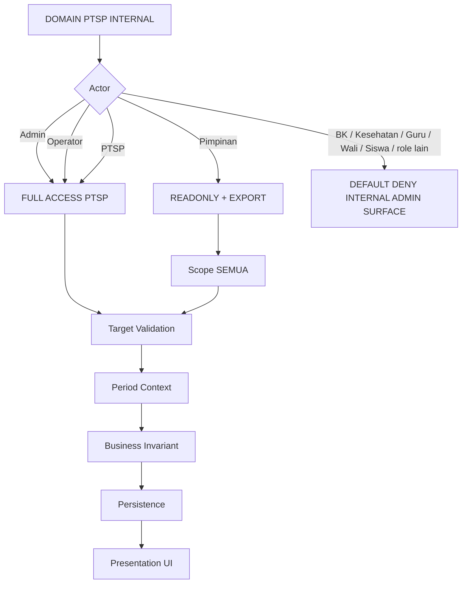
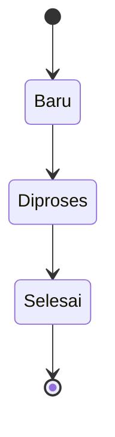
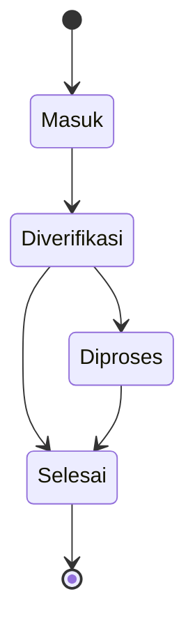
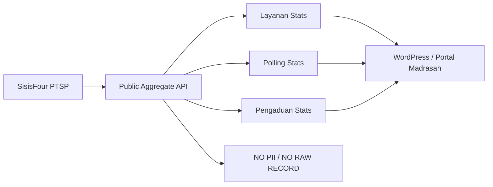

# PTSP — SisisFour

**Status:** Canonical / G3.6B Implementation Active
**Tanggal Acuan:** 19 September 2026
**Global guardrail:** `00_POLA_PENGERJAAN___SisisFour.md` + `00A_GLOBAL_STANDARD_SISFOUR.md`
**Source field:** workbook `field-form-UKS-CKG-PTSP.xlsx`, sheet `Form Layanan PTSP`, `Pengaduan`, dan `Form Polling Kepuasan`.

> Dokumen ini adalah SSOT domain PTSP. Keputusan user terbaru mengalahkan catatan lama pada workbook bila ada konflik.

## 1. Role & Identity

Role resmi domain:

```text
ptsp
```

Identity:

```text
Role PTSP -> Pegawai -> users.id_pegawai
multi-role -> YA
```

Full Access PTSP **hanya berlaku pada domain PTSP**, bukan seluruh aplikasi.

## 2. Menu / Surface

Authenticated menu:

```text
PTSP
├── Layanan PTSP
├── Polling Kepuasan
└── Pengaduan
```

Public surface **LOCKED / refinement 19 September 2026**:

```text
PTSP Landing Page — pola Kios
├── Layanan PTSP
├── Pengaduan
└── Polling Kepuasan
```

Landing hanya menampilkan tiga tombol besar dalam urutan tersebut. Pengunjung memilih salah satu tombol untuk membuka halaman form tersendiri; form tidak lagi ditumpuk sebagai tab dalam satu halaman.

## 3. Access Boundary Internal



Canonical capability:

| Actor | View | Create/Internal Mutation | Update Status | Export XLSX | Hard Delete | Scope |
|---|---|---|---|---|---|---|
| Admin | YA | YA | YA | YA | YA | SEMUA |
| Operator | YA | YA | YA | YA | YA | SEMUA |
| PTSP | YA | YA | YA | YA | YA | SEMUA |
| Pimpinan | YA | TIDAK | TIDAK | YA | TIDAK | SEMUA |

Role lain tidak mendapat internal PTSP administration hanya karena public form dapat diakses tanpa login.

## 4. Public Submission Boundary

Ketiga form berikut adalah **public form tanpa login**:

```text
Layanan PTSP
Polling Kepuasan
Pengaduan
```

Public form tidak memberi akses ke listing/detail/admin PTSP.

Target awal proteksi dibuat minimal sesuai keputusan user:

```text
server-side validation
CSRF bila form berjalan same-origin
upload validation untuk Pengaduan
busy guard / anti-double-submit
```

CAPTCHA/honeypot/anti-spam lanjutan tidak diwajibkan pada target awal; dapat ditambah bila kebutuhan runtime muncul.

## 5. Period Context PTSP

Semua submission PTSP snapshot Tahun Ajaran aktif secara server-side.

```text
Public/Create            -> Tahun Ajaran aktif
Read / History           -> Tahun Ajaran filter
Update Existing          -> tetap Tahun Ajaran record
Export                    -> Tahun Ajaran terpilih
Statistics API default   -> Tahun Ajaran aktif / dapat difilter period
Reset internal filter    -> Tahun Ajaran aktif
```

Jika tidak ada Tahun Ajaran aktif, create baru tidak boleh menghasilkan record periodik tanpa period snapshot.

PTSP memakai Tahun Ajaran sebagai konteks administrasi madrasah; pemohon tidak harus siswa.

## 6. Layanan PTSP

Field canonical dari workbook:

```text
Nama Lengkap              wajib
Kategori Pemohon          wajib
  - Siswa/Siswi
  - Alumni
  - Wali Murid
  - Guru/Staff
  - Umum/Instansi Lain
Nomor WhatsApp            wajib
Jenis Layanan             wajib
  - Legalisir Ijazah/Raport
  - Rekomendasi Mutasi Siswa
  - Surat Keterangan Lulus (SKL)
  - Surat Keterangan Aktif Belajar
  - Surat Keterangan Lainnya
  - Layanan Kepegawaian
  - Pendaftaran Siswa Baru
  - Lainnya
Tujuan / Keterangan       wajib
```

Workflow:



Mutation status:

```text
Admin / Operator / PTSP
```

Tidak ada requirement follow-up 1:N dan tidak ada SLA pada kontrak saat ini.

Petugas operasional adalah role PTSP; actor mutation tetap `users.id`.

### Cetak Thermal

Catatan workbook lama `mencetak tiket antrian` **digantikan keputusan user terbaru**.

Contract cetak G3.6B:

```text
media                   = thermal 80 mm
manual print            = selalu tersedia setelah submit sukses
auto print              = configurable ON/OFF
setting key auto print       = ptsp_layanan_auto_print
setting key auto PDF         = ptsp_layanan_auto_download_pdf
setting location             = Settings -> Setting Sistem
default                      = keduanya OFF
Auto Print ON                = membuka dialog print browser setelah submit sukses
Auto Print OFF + Auto PDF ON = otomatis download PDF thermal lebar 80 mm
keduanya OFF                 = hanya tombol Cetak Bukti manual
```

Prioritas mode: Auto Print menang bila kedua setting ON. Auto Print tidak berarti silent/background printing; kontrol printer/browser tetap berlaku.

PDF auto-download dibuat langsung dari receipt payload submit yang tervalidasi menggunakan Dompdf existing. PDF tidak memakai public lookup route, ticket, antrean, tracking code, atau public record ID. Lebar media PDF = 80 mm; tinggi mengikuti kebutuhan isi receipt.

Presentation receipt **LOCKED refinement**:
- layout dibuat compact seperti struk thermal;
- label dan nilai menggunakan baris yang sama bila ruang memungkinkan;
- spacing antarbaris, separator, dan footer diminimalkan;
- receipt normal wajib muat satu halaman PDF 80 mm;
- isi yang sangat panjang boleh menambah tinggi media agar tidak terpotong.

Setelah submit:

```text
-> tampilkan sukses
-> dapat cetak di printer thermal
-> isi cetak = bukti sudah mengisi
-> TANPA nomor tiket
-> TANPA nomor antrean
-> TANPA kode tracking
```

Bukti thermal dapat berisi ringkasan non-rahasia seperti waktu submit, nama pemohon, kategori, jenis layanan, dan keterangan sukses.

## 7. Polling Kepuasan

Semua pihak dapat mengisi public polling dan submission berulang diperbolehkan; tidak ada dedup berdasarkan WhatsApp pada kontrak saat ini.

Field canonical:

```text
Nama Lengkap
Kategori Responden
  - Siswa/Siswi
  - Alumni
  - Wali Murid
  - Guru/Staff
  - Umum/Instansi Lain
Nomor WhatsApp
Tingkat Kepuasan
  - Sangat Memuaskan
  - Memuaskan
  - Cukup Memadai
  - Kurang Memuaskan
  - Sangat Mengecewakan
Masukan & Saran
```

Storage kepuasan:

```text
label original + numeric score
Sangat Memuaskan      = 5
Memuaskan             = 4
Cukup Memadai         = 3
Kurang Memuaskan      = 2
Sangat Mengecewakan   = 1
```

Label tetap dipakai di UI; score dipakai untuk statistik/dashboard.

Pimpinan memiliki ReadOnly SEMUA dan dapat melihat data individual polling pada internal surface.

## 8. Pengaduan

Pengaduan adalah **satu public form anonim**. Tidak dibedakan internal vs eksternal pada data/form.

Field canonical:

```text
Klasifikasi Laporan, multi-pilih
  - Pengaduan
  - Aspirasi
  - Permintaan Informasi
Judul Laporan
Isi Laporan
Tanggal Kejadian
Lampiran (opsional)
  - PDF
  - PNG
  - JPG/JPEG
  - maksimal 5 MB
  - private WRITEPATH, bukan public/uploads
  - download hanya melalui authenticated authorization
```

Form tidak meminta nama/kontak pelapor.

Workflow:



Tidak ada follow-up child 1:N, tidak ada disposisi unit lain, dan tidak ada tracking code publik pada kontrak saat ini.

Internal actor yang berhak melihat data Pengaduan:

```text
Admin
Operator
PTSP
Pimpinan (ReadOnly)
```

## 9. Delete PTSP

Layanan, Polling, dan Pengaduan dapat di-hard-delete oleh:

```text
Admin
Operator
PTSP
```

Pimpinan ReadOnly dan tidak mempunyai destructive capability.

Hard delete adalah keputusan domain PTSP eksplisit; tidak boleh digeneralisasi ke domain lain.

Delete harus melalui authorization Service dan project confirmation pada UI.

## 10. Export

Format export:

```text
XLSX
```

Akses export PTSP:

```text
Admin
Operator
Pimpinan
PTSP
```

Export mengikuti filter Tahun Ajaran dan filter lain yang sedang aktif.

Role Kesehatan tidak otomatis mempunyai export PTSP; Full Access Kesehatan hanya berlaku di domain UKS.

## 11. Public Statistics API

PTSP wajib menyediakan **API statistik public read-only untuk masing-masing form** agar dapat dipasang pada portal berita/web madrasah seperti WordPress.

Canonical target:

```text
GET /api/public/ptsp/statistik/layanan
GET /api/public/ptsp/statistik/polling
GET /api/public/ptsp/statistik/pengaduan
```

Nama route final boleh disesuaikan saat implementasi, tetapi kontrak output tetap: **aggregate only, tidak membocorkan data personal/raw record**.

### Statistik Layanan

Target aggregate minimum:

```text
total submission
jumlah per status
jumlah per kategori pemohon
jumlah per jenis layanan
periode/Tahun Ajaran
```

### Statistik Polling

Target aggregate minimum:

```text
total responden
jumlah per kategori responden
distribusi label kepuasan
distribusi score 1..5
rata-rata score
periode/Tahun Ajaran
```

### Statistik Pengaduan

Target aggregate minimum:

```text
total laporan
jumlah per klasifikasi
jumlah per status
periode/Tahun Ajaran
```

Public statistics API **tidak boleh mengeluarkan**:

```text
Nama
Nomor WhatsApp
Judul laporan
Isi laporan
Tanggal kejadian individual
Lampiran
raw record identifier yang dapat dipakai enumerasi data privat
```

API bersifat GET/read-only dan dirancang dapat dikonsumsi lintas-origin oleh portal/WordPress.

Discovery/documentation UI **LOCKED refinement**:

```text
Settings -> Setting Sistem -> API Statistik PTSP
```

UI menampilkan tiga card:
- Statistik Layanan PTSP;
- Statistik Pengaduan;
- Statistik Polling Kepuasan.

Setiap card wajib menampilkan endpoint aktual, badge GET/PUBLIC/CORS/Aggregate Only, contoh script `fetch()`, tombol Copy URL, dan tombol **Copy Script API**. Script memakai endpoint public aktual dari `base_url`, default Tahun Ajaran aktif, dengan komentar `?id_tahun=ID_TAHUN` untuk histori.

CORS G3.6B **LOCKED**:

```text
surface            = hanya /api/public/ptsp/statistik/*
allowed origin     = *
allowed methods    = GET / OPTIONS
credentials        = false
```

Konfigurasi CORS tidak boleh membuka API protected lain. Implementasi dapat menyediakan reusable copy/paste JavaScript/widget snippet yang membaca endpoint tersebut.



## 12. Dashboard

Role PTSP mempunyai landing/dashboard tersendiri. Dashboard adalah current-state Tahun Ajaran aktif dan tidak mempunyai selector histori.

Role experience priority G3.6B **LOCKED**:

```text
admin > operator > pimpinan > bk > kesehatan > ptsp > guru > siswa
```

Dashboard PTSP **LOCKED**:

```text
KPI
- Layanan Baru
- Layanan Diproses
- Pengaduan Masuk
- Rata-rata Kepuasan

Quick Action
- Layanan PTSP
- Polling Kepuasan
- Pengaduan
- Buka Public PTSP

Recent
- Layanan terbaru max 5
- Pengaduan terbaru max 5
- Ringkasan Kepuasan
```

Pimpinan **tidak memerlukan widget PTSP tambahan pada dashboard utama Pimpinan**; Pimpinan mengakses data melalui menu PTSP ReadOnly.

## 13. Audit

Mutation internal wajib masuk audit/log activity:

```text
status update
hard delete
internal administrative mutation
```

Public submission menyimpan created timestamp dan period snapshot. Actor authenticated menggunakan `users.id`; display actor Role PTSP melalui `users.id_pegawai -> pegawai.nama`.

Data PTSP diperlakukan sebagai data operasional biasa sesuai keputusan user; tidak ada redaction khusus di internal authorized surface selain larangan exposure melalui public statistics API.

## 14. Testing Minimum

```text
public Layanan dapat submit tanpa login
public Polling dapat submit tanpa login dan berulang
public Pengaduan anonim dapat submit tanpa login
semua create snapshot Tahun Ajaran aktif
internal Admin/Operator/PTSP full domain
Pimpinan readonly SEMUA + export
role lain DENY internal PTSP administration
workflow Layanan Baru -> Diproses -> Selesai
workflow Pengaduan Masuk -> Diverifikasi -> Diproses/Selesai
hard delete hanya Admin/Operator/PTSP
thermal receipt tidak memiliki nomor tiket/antrian/tracking
XLSX mengikuti period/filter
statistics API aggregate-only
statistics API tidak membocorkan PII/raw record
WordPress/cross-origin consumption bekerja sesuai kontrak
mobile/public landing no horizontal overflow
```

## 15. Implementation Mapping G3.6B

Branch:

```text
feat/g3-6b-ptsp-20260919
baseline main = 90acc7f94fee391a5a7fbad2395e3f16571fe921
```

Persistence:

```text
ptsp_layanan
ptsp_polling
ptsp_pengaduan
ptsp_pengaduan_klasifikasi
```

Permission:

```text
ptsp_layanan.view
ptsp_layanan.manage
ptsp_layanan.export
ptsp_layanan.delete
ptsp_polling.view
ptsp_polling.export
ptsp_polling.delete
ptsp_pengaduan.view
ptsp_pengaduan.manage
ptsp_pengaduan.export
ptsp_pengaduan.delete
```

Klasifikasi Pengaduan disimpan relational melalui junction table, bukan JSON/string gabungan. Hard delete tetap capability eksplisit domain PTSP.

Public submission tetap web same-origin agar CSRF global berlaku. Receipt thermal Layanan dibuat dari response submit yang baru diterima, tanpa public lookup ID/nomor tiket/antrean/tracking.

## 16. Current Gate

```text
G3.6A UKS / Kesehatan        CLOSED / MERGED — PR #13
G3.6A merge commit           90acc7f94fee391a5a7fbad2395e3f16571fe921
G3.6B contract               LOCKED
G3.6B source                 IMPLEMENTED / feature branch
G3.6B localhost SQL          PASS / user evidence
G3.6B static/local UAT       PASS / user evidence
G3.6B local dump audit       PASS / read-only dump audit
G3.6B fresh hosting dump     PASS / read-only dump audit
G3.6B hosting SQL            PREPARED / static audited
G3.6B hosting SQL execution  PASS / user evidence
G3.6B post-SQL hosting dump  PASS / read-only dump audit
G3.6B source deployment      PASS / user evidence
G3.6B hosting runtime smoke  PENDING
```